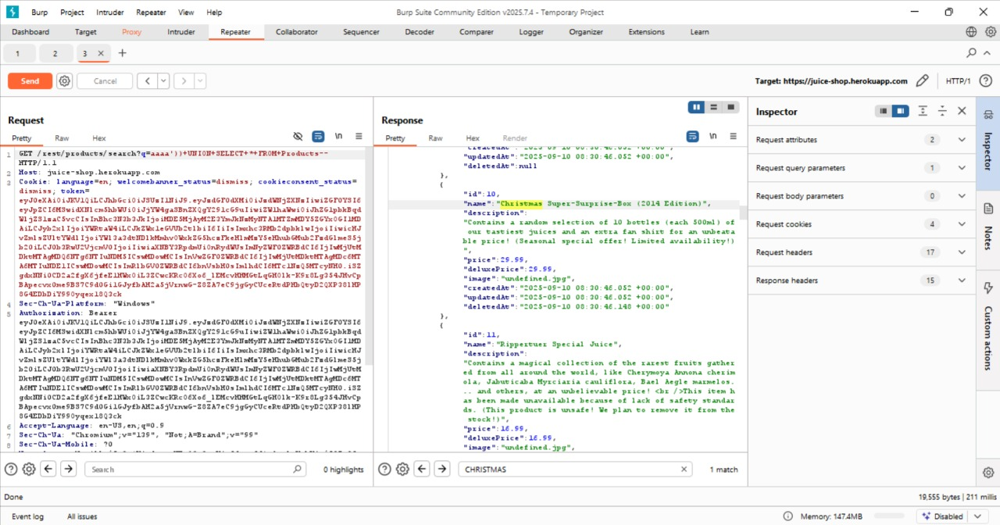
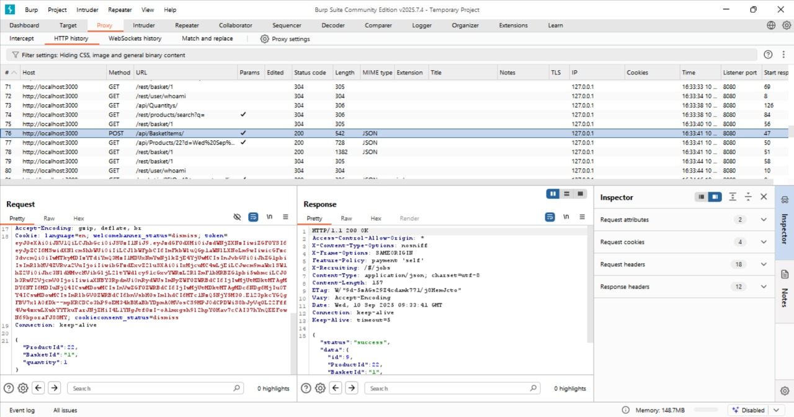
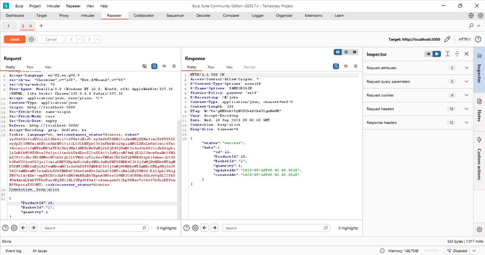
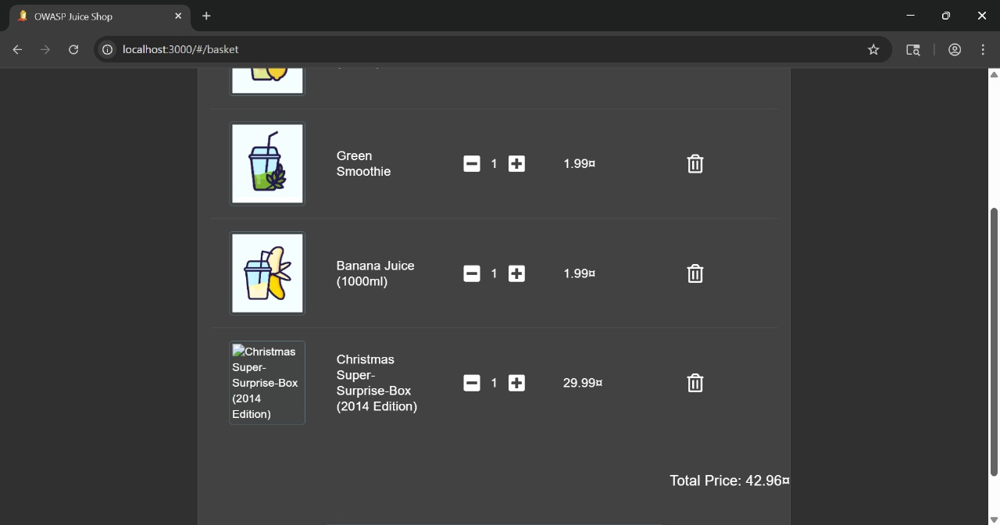

# Christmas Special

## Challenge Overview

**Title:** Christmas Special

**Category:** SQL Injection / Hidden Product Retrieval

**Difficulty:** ⭐⭐⭐⭐ (4/6)

Tujuan challenge ini adalah menemukan dan memesan produk tersembunyi **Christmas Special 2014**, yang tidak tampil di halaman produk karena ditandai sebagai *deleted* di database.

---

## Tools Used

* **Web Browser** → interaksi dengan aplikasi.
* **Burp Suite** → intercept & modifikasi request untuk eksploitasi SQLi dan manipulasi request add-to-cart.

---

## Step by Step Solution

### 1. Identifikasi Produk Tersembunyi

* Endpoint search `/rest/products/search?q=...` sudah diketahui rentan SQLi (dari challenge sebelumnya).
* Payload digunakan untuk menampilkan seluruh produk, termasuk yang sudah *deleted*:

  ```sql
  aaaa')) UNION SELECT * FROM Products--
  ```
* Hasil: produk **Christmas Special** ditemukan dengan **ProductId = 10**.

    

---

### 2. Tambahkan Produk ke Keranjang

1. Tambahkan produk apapun secara normal ke keranjang belanja.
2. Intercept request `POST /api/BasketItems/` menggunakan Burp Suite.

    
3. Ubah parameter `ProductId` menjadi **10** (ProductId Christmas Special).

    

---

### 3. Verifikasi di Keranjang

* Buka halaman keranjang.
* Produk **Christmas Special 2014** berhasil muncul di daftar belanja.

    

---

## Solution Explanation

* Aplikasi hanya menampilkan produk dengan `deletedAt IS NULL`.
* Dengan **UNION SQLi**, query diubah sehingga seluruh produk ditampilkan, termasuk yang ditandai *deleted*.
* Setelah mengetahui ProductId, modifikasi request add-to-cart membuat produk **Christmas Special** bisa dipesan meski tidak terlihat di UI.

---

## Remediation

* Gunakan **Prepared Statements / Parameterized Queries** untuk mencegah SQLi.
* Terapkan **akses kontrol ketat**: produk yang ditandai *deleted* seharusnya tidak bisa dipesan meskipun ProductId diketahui.
* Jangan hanya menggunakan flag `deletedAt` untuk menyembunyikan data sensitif; gunakan soft-delete dengan kontrol akses tambahan atau benar-benar hapus produk dari database.