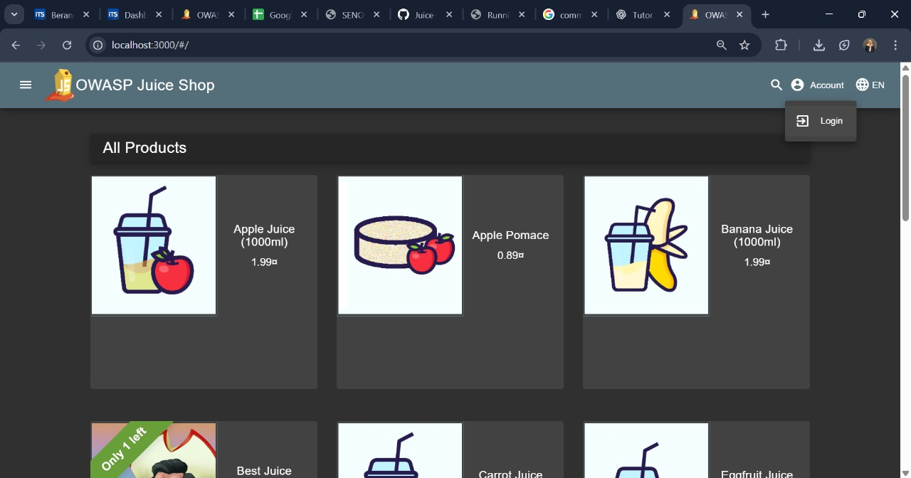
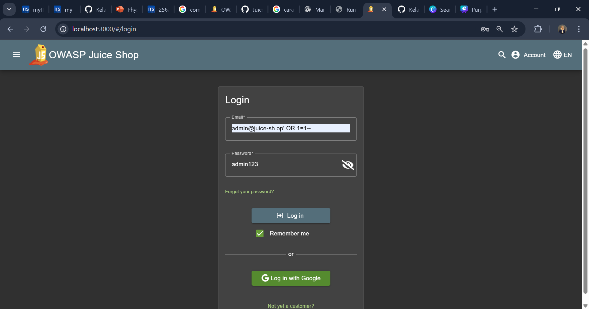
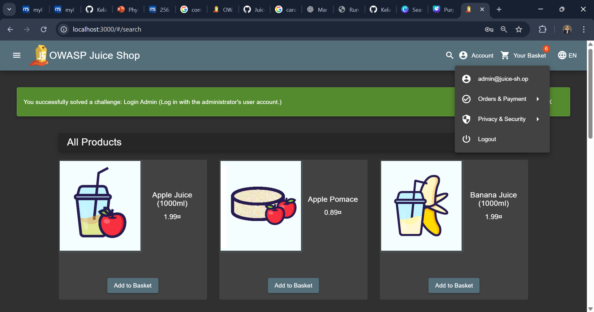

# Login Admin

## Challenge Overview

**Title:** Login Admin

**Category:** SQL Injection (SQLi)

**Difficulty:** ⭐⭐ (2/6)

Eksploitasi ini memanfaatkan kelemahan SQL Injection pada proses autentikasi untuk memperoleh akses ke akun administrator tanpa mengetahui password. Tujuan praktisnya: tunjukkan bahwa input yang tidak disanitasi dapat mengubah struktur query sehingga melewati pengecekan password.

---

## Tools Used

* **Web browser** (Chrome / Firefox) — akses UI login.
* **Developer Tools** (Network tab) — melihat request/respon jika tidak memakai proxy.

---

## Step by Step Solution

### Persiapan

1. Jalankan Juice Shop di mesin lokal (`/http://localhost:3000`).
2. Buka halaman **Account → Login**.

   

### Langkah eksploitasi 

1. Pada field **Email**, masukkan payload berikut :

   ```
   admin@juice-sh.op' OR 1=1--
   ```
2. Pada field **Password**, isi sembarang teks (mis. `admin123`) — nilai password akan diabaikan oleh query yang dimanipulasi.

   
3. Klik **Log in**.
4. Verifikasi: jika sukses, dashboard/profil akan menampilkan akun **Administrator**. 

   
 
---

## Solution Explanation

**Kenapa payload ini bekerja:**
Struktur query autentikasi yang rentan biasanya seperti:

```sql
SELECT * FROM users WHERE email = '$email' AND password = '$password';
```

Dengan `email = admin@juice-sh.op' OR 1=1--`, query berubah menjadi (ilustrasi):

```sql
SELECT * FROM users 
WHERE email = 'admin@juice-sh.op' OR 1=1--' 
AND password = '...';
```

* `OR 1=1` selalu bernilai true → kondisi keseluruhan jadi true.
* `--` mengomentari sisa query sehingga pemeriksaan password diabaikan.
* Database mengembalikan record (sering record pertama yang cocok), sehingga aplikasi menganggap autentikasi valid dan memberikan akses admin.

---

## Security Recommendations

Untuk mencegah SQL Injection pada mekanisme login:

1. **Prepared Statements / Parameterized Queries**

   * Gunakan API database yang memisahkan kode & data (mis. parameter binding). Jangan menyusun query dengan string concatenation.

2. **Input Validation**

   * Validasi format input (email harus sesuai regex). Reject atau escape karakter berbahaya di server-side, bukan hanya client-side.

3. **Least Privilege untuk DB User**

   * Akun aplikasi harus punya hak minimum (mis. SELECT tertentu), hindari penggunaan user DB dengan hak admin.

4. **Error Handling & Logging**

   * Jangan tampilkan error SQL ke user. Log error di server (dengan alerting) tapi tampilkan pesan generik ke client.

5. **Rate Limiting & Anomali Deteksi**

   * Terapkan pembatasan percobaan login dan deteksi pola injeksi pada WAF/IDS.

6. **Code Review & Security Testing**

   * Rutin lakukan code review, scanning SAST, dan pentest (termasuk input fuzzing).

7. **Referensi & Edukasi**

   * Pelajari contoh aman/berisiko di repo referensi (mis. `OWASP/juice-shop`, `DVWA`) untuk memahami pola kerentanan & mitigasi.
