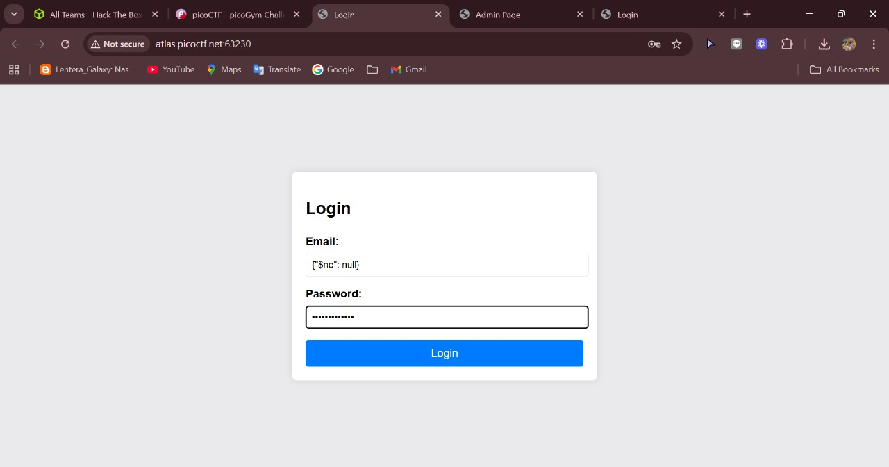
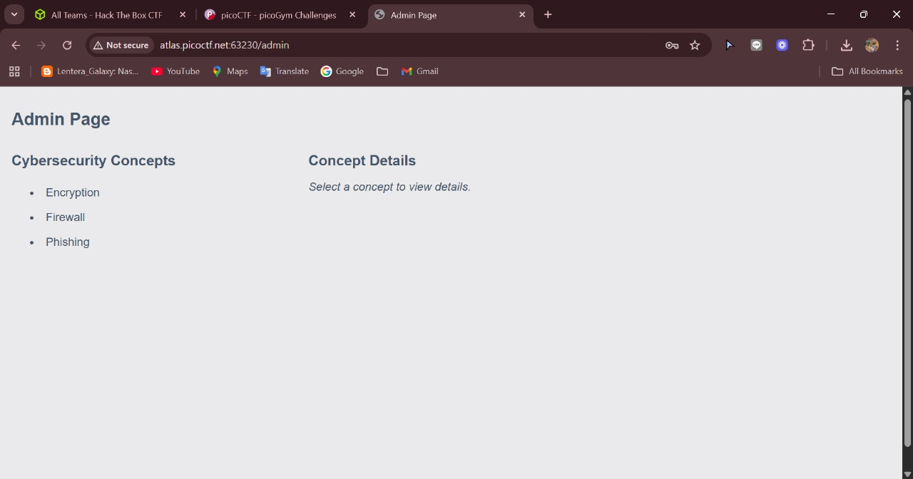
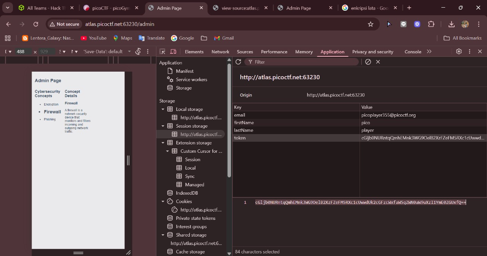
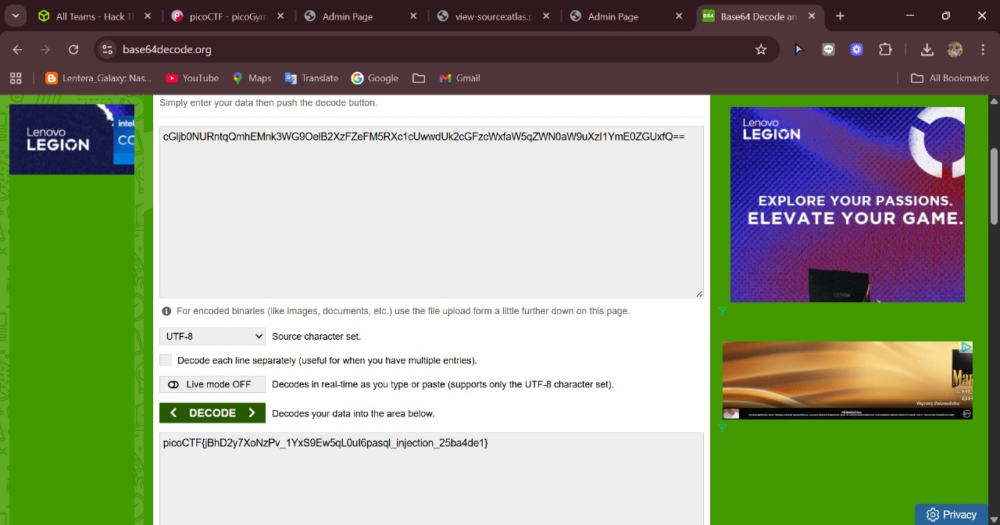

# NoSQL Injection

## Challenge Overview

**Title:** NoSQL Injection

**Category:** Injection

Tujuan dari challenge ini adalah mengeksploitasi kelemahan **NoSQL Injection** pada form login untuk mendapatkan akses ke halaman admin, kemudian mencari flag yang tersembunyi di aplikasi.

---

## Tools Used

* **Web Browser**: Untuk mengakses aplikasi target.
* **Burp Suite / DevTools**: Untuk menginspeksi request/response, session storage, dan cookies.
* **Base64 Decoder**: Untuk mendekodekan data yang ditemukan pada token.

---

## Step by Step Solution

### 1. Login Bypass dengan NoSQL Injection

* Pada halaman login, percobaan menggunakan SQL Injection klasik (`' OR '1'='1`) gagal.
* Mengingat challenge menyebut *NonSQL injection exists*, berarti database yang digunakan kemungkinan **MongoDB**.
* Payload yang berhasil digunakan:

```json
username: {"$ne": null}
password: {"$ne": null}
```

* Artinya query yang dikirim ke backend adalah `username != null AND password != null`, sehingga login berhasil tanpa kredensial valid.
* Setelah login, kita diarahkan ke **Admin Page**.


---

### 2. Eksplorasi Admin Page

* Di halaman admin hanya ada beberapa konsep cybersecurity (Encryption, Firewall, Phishing).
* Tidak ada flag langsung yang muncul di halaman.

    

---

### 3. Cek Storage & Token

* Melalui **DevTools → Application → Session Storage**, ditemukan ada beberapa data:

  * `email = picoplayer355@picoctf.org`
  * `firstName = pico`
  * `lastName = player`
  * `token = cGljb0NURntqQmhEMnk3WG9OelB2XzFZeFM5RXc1cUwwdUk2cGFz...`

* Nilai `token` terlihat seperti **Base64 encoded string**.

    

---

### 4. Decode Token

* String token didapatkan:

```
cGljb0NURntqQmhEMnk3WG9OelB2XzFZeFM5RXc1cUwwdUk2cGFzcWxfaW5qZWN0aW9uXzI1YmE0ZGUxfQ==
```

* Setelah didekodekan (Base64 → UTF-8), hasilnya adalah:

```
picoCTF{jBhD2y7XoNzPv_1YxS9Ew5qLOul6pasql_injection_25ba4de1}
```